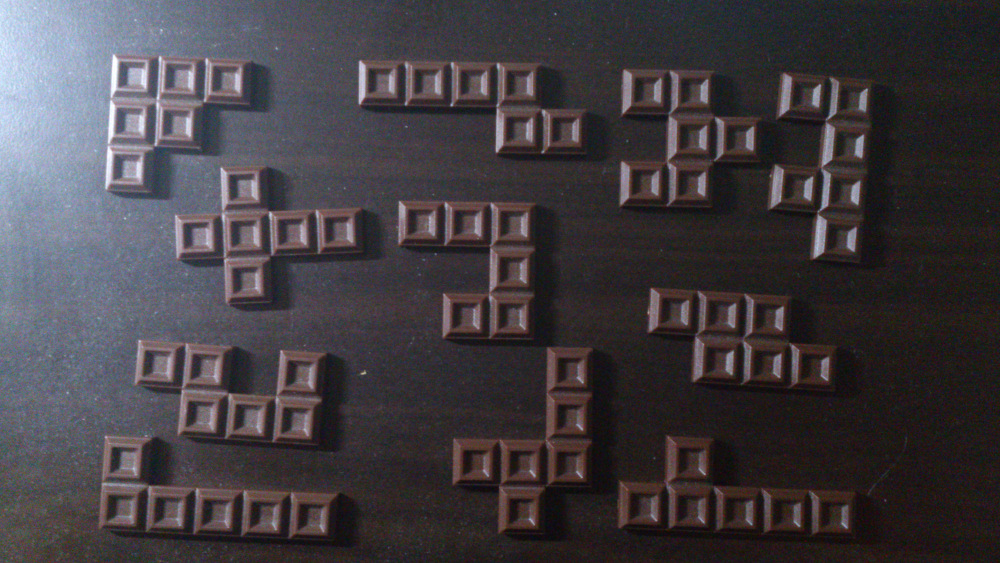
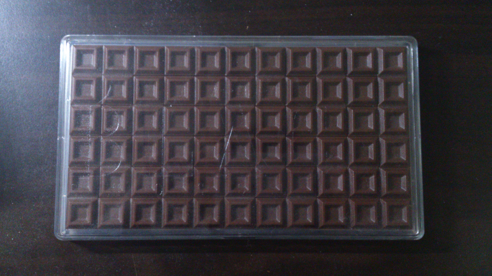

# 問題00-06 Hexomino Chocolate

Fig.1に示した、かけらをつなぎ合わせて、Fig.2のような横11x横6マスの板チョコを作れ。

ただし、かけらは
 - 平行移動
 - 回転
は出来るが
 - 裏返し
はできない。

[問題ソース](http://www.hanayamatoys.co.jp/product/category/puzzle/meiji/meiji-black.html)

P.S. 解法とマシンによるが、計算時間がとてもかかる(ozzio mx5260sdxpで8時間)場合があるので、注意。
